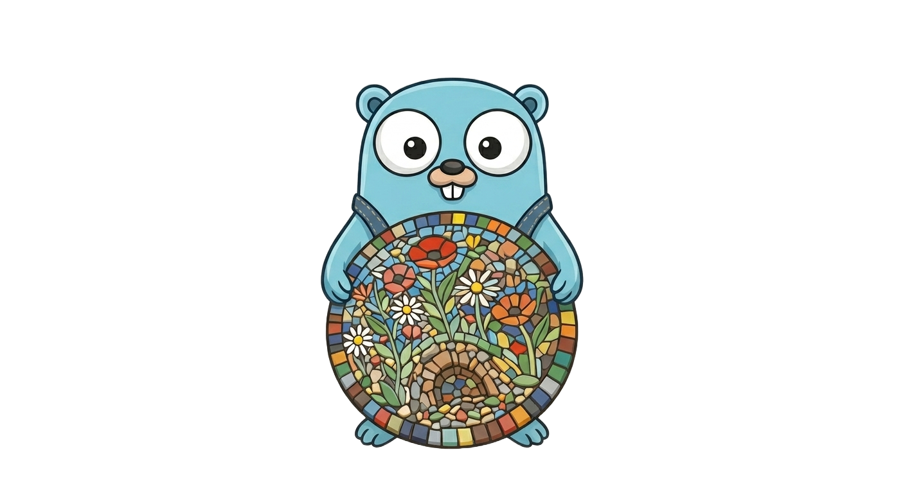

<p align="center">
  
</p>

<h1 align="center">mosaic</h1>

[](https://github.com/nit4y/mosaic/actions/workflows/ci.yml)
[](https://pkg.go.dev/github.com/nit4y/mosaic)
[](https://goreportcard.com/report/github.com/nit4y/mosaic)
[](https://github.com/nit4y/mosaic/releases)
[](https://www.gnu.org/licenses/gpl-3.0)

Turn a panning video into a wide **panoramic mosaic** - the "VideoBrush"
strip-mosaicing technique (Peleg et al.) implemented in Go on top of
[GoCV](https://gocv.io/) / OpenCV.

## Example

**Input** - a panning video:

<p align="center">
  
</p>

**Output** - the mosaic panoramas video:

<p align="center">
  
</p>

## How it works

1. **Extract frames** - decode the video, trim black borders, and detect the
   dominant pan direction so motion runs horizontally.
2. **Align adjacent frames** - track [Shi Tomasi corners]([url](https://en.wikipedia.org/wiki/Corner_detection#The_Harris_&_Stephens_/_Shi%E2%80%93Tomasi_corner_detection_algorithms)) across each consecutive
   pair with [Lucas-Kanade]([url](https://en.wikipedia.org/wiki/Lucas%E2%80%93Kanade_method)) optical flow, then fit a [RANSAC]([url](https://en.wikipedia.org/wiki/Random_sample_consensus)) partial-affine
   transform reduced to horizontal translation, accumulated against a central
   reference frame.
3. **Warp** - project every aligned frame onto a shared canvas in parallel.
4. **Stitch** - sweep a column offset across the frames, painting each frame's
   thin strip; optional feather-blending hides the seams.

## Requirements

GoCV requires OpenCV (4.x) installed locally - see the
[GoCV install guide](https://gocv.io/getting-started/).

```sh
go get github.com/nit4y/mosaic
```

## License

[GPL-3.0](LICENSE).
